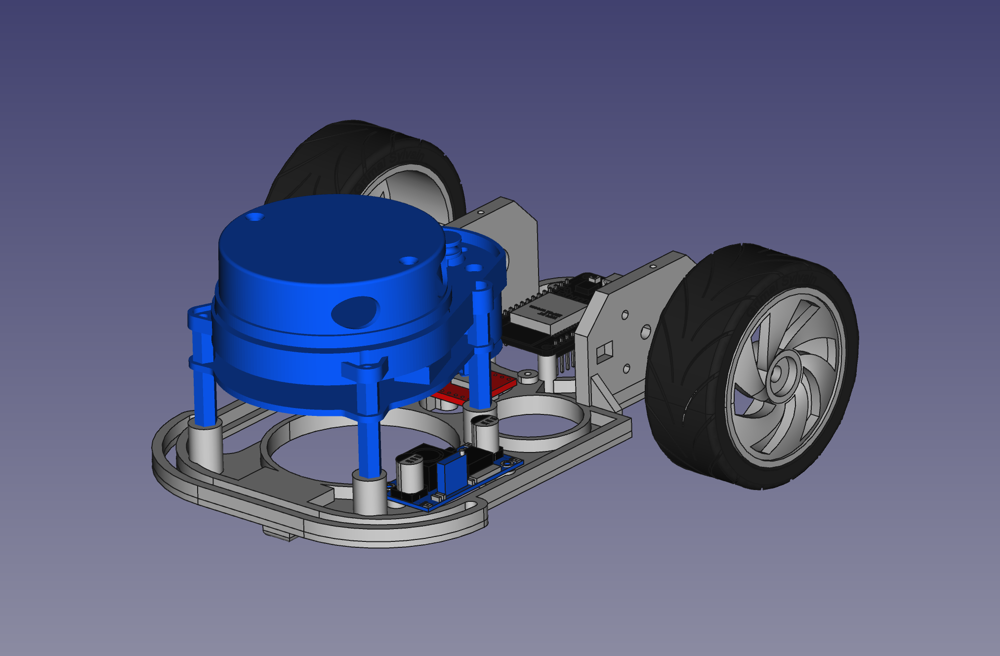
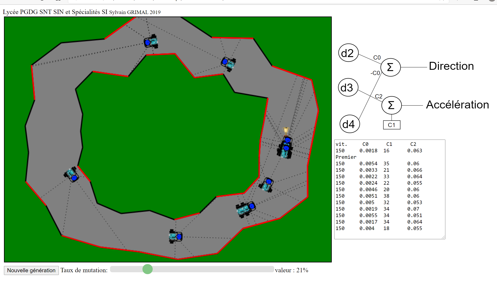
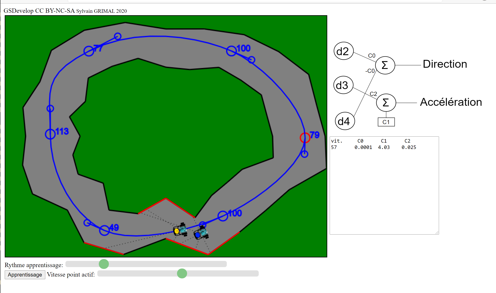
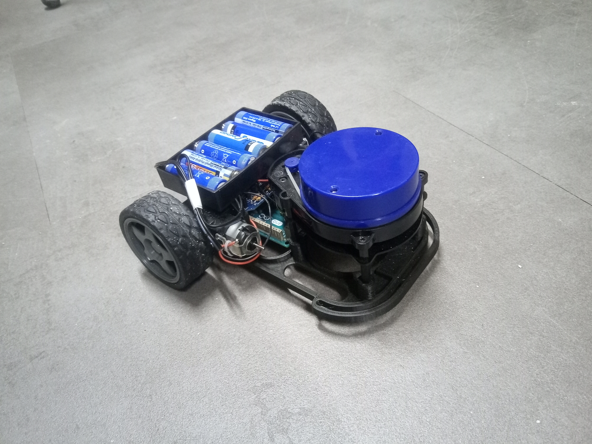

 

   
    
   Plateforme de découverte et d'étude de L'Intelligence Artificielle 
   Véhicule autonome 

##    1) Introduction

Cortex est un véhicule d'étude de l'Intelligence Artificielle avec réseaux de neurones.
cliquer pour voir la vidéo sur youtube:

Cette plateforme permet de découvrir les alghorithmes génétiques ainsi que l'apprentissage supervisé.

 

Il comprend des 3 programmes, en javascript, de simulation permettant l'entrainement d'un reseau de neurones ainsi qu'un petit véhicule réel d'experimentation.
Le véhicule perçoit son environement grâce à un lidar "YDlidar X4". L'utilisation d'un "X2" est en cours de developpement.

Nb: le lidar X4 a une vitesse de transmission série de 128 000 bps, non standard, elle le rend incompatible avec une carte Uno (cf. diviseur de fréquence) le "X2" a une vitesse de 115 200 bps mais le flux continu des données risque de saturer un µp à 8 Mhz. La taille du tampon de données doit, d'ailleurs, être augmentée sur une Due: C:\Users\xxxxxxx\AppData\Local\Arduino15\packages\arduino\hardware\sam\1.6.12\cores\arduino\RingBuffer.h #define SERIAL_BUFFER_SIZE 64 par defaut 512 pour éviter les erreurs.

 

La version la plus simple comprend 5 neurones: 3 de présentation et 2 de sortie.

Il existe aussi une version à 12 neurones: 5 de présentation, 5 d'une couche intermédiaire et 2 de sortie.
 
La couche de présentation contient les 5 distances du véhicule au bord de la route dans 5 directions (-90° -45° 0° 45° 90°)

**GeneticCortex5:** Version pour découvrir les algorithmes génétiques avec 5 neurones ( seules les distance à -45° 0° et 45° sont utilisées ) et seulement 3 poids synaptiques (dont 1 biais).  Les gènes sont directement les poids synaptiques. La premiere génération utilise des poids générés aléatoirement. 
Seul le véhicule de tête voiture peut se reproduire, A chaque nouvelle génération les poids prennent une valeur entre ceux du parent et une valeur aléatoire en fonction d'un taux de mutation ( taux de 0: tous les enfants ont les mêmes caractéristiques que le parent, taux de 1: chaque génération ne depend pas du parent ) 
Avec seulement trois gènes l'évolution est très rapide.

**Attention**, il est important de comprendre que vue la structure utilisée (pas de vision globale de la route, pas de neurone recursif) il est illusoire d'obtenir de l'anticipation avant le virage (déport à droite pour tourner à gauche, passage à la corde puis élargissement de la trajectoire etc.) imaginez vous conduire avec seulement comme indication la distance du bord de route à 45° droite, en face et à 45° gauche !

**LearningCortex5:** Version pour découvrir l'apprentissage supervisé, on retrouve la configuration neuronale de la version génétique. 
Il est necessaire de definir la trajectoire à suivre à la souris: On peut modifier les points de passages, les tangeantes et aussi la vitesse. Entre les points de passage la vitesse varie linéairement. 
Le véhicule professeur suit la trajectoire, il est possible de récupérer les différents echantillons de l'apprentissage dans un fichier csv qui comprend les trois informations de distance et les valeurs cibles du professeur (direction et vitesse). 
Les calculs des coefficients peuvent être alors fait par regression lineaire dans un tableur: il faut trier les valeurs non significatives (quand d4-d2<100) puis calculer les valeurs par régression lineaire (attention pour la direction la droite doit passer par zero et l'option régression linéaire ne le fait pas, il faut donc entrer les formules). 
Le calcul peut aussi être automatique (on utilise, dans le programme javaScript, pour la direction la moyenne entre la regression horizontale et verticale, on pourrait aussi utiliser une régression orthogonale mais le calcul est un peu plus complexe sans apporter d'avantage significatif )

**LearnigCortex12:** Version à 12 neurones et 42 poids synaptiques (avec les biais), elle est destinée à la découverte de l'apprentissage supervisé avec rétropropagation du gradient d'erreur. La fonction d'activation est une sigmoïde (une version avec fonction ReLu est à l'étude). 
Une premiere version ne comprend que la direction (11 neurones: 1 seul neurone de sortie et 36 poids synaptiques) et permet d'appréhender les calculs de rétropropagation du gradient d'erreur sur la couche de sortie et la couche cachée. 
La version 12 neurones est en cours de developpement.

**Maquette:** Le modèle est entierement imprimable en 3D. Si vous utilisez une Arduino Due il faut couper les fixations de ESP 32 après l'impression. Les coefficients obtenus sur les simulations sont à copier dans le programme Arduino.

**Dans le dépot Cortex vous trouverez :**

* les fichiers CAO, STL pour imprimantes 3D
* Les sources Html et javascript pour l'entrainement
* Le source ESP32 (en cours) ou Arduino Due pour IDE Arduino

L'ensemble est sous licence **CC BY-NC-SA**

**Les éléments suivants sont nécessaires:**

* YDlidar X4 (essai en cours pour passer à un X2, moins cher)
* Arduino Due ou ESP32 ( Il existe de nombreux modules, les fixations sont prévues pour un ESP32 DEVKIT V1: 30 broches)
* Carte double variateur type TB6612 ou DRV8833 ou shield moteur pour Arduino Due
* Module d'alimentation découpage type lm2596
* 2 x Moteurs reductés, roues
* Support de batterie
* Visserie

##    2) Câblage

**Liasons Arduino Due ou ESP32 Lidar:**  
* Série: Due RX1 / ESP32 RX2           <-> Tx Lidar X4 Tx X2
* Série: Due TX1 / ESP32 TX2           <-> Rx Lidar X4 Nc X2
* Vitesse Moteur Due D7 / ESP32 GPIO 23<-> M_SCTR Lidar X4 M_SCTR X2
* Enable Due D3 / ESP32 GPIO 27        <-> M_EN Lidar X4 Nc X2

**Liaisons Arduino Due ou ESP32 Variateur:**  
* Due D5 /  ESP32 GPIO 35 <-> APWM 
* Due D4 /  ESP32 GPIO 34 <-> AIN1  // Marche avant: 0 Marche arrière: 1  
* Nb: Nc                  <-> AIN2                          // Marche avant: 1 Marche arrière: 0
* Due D9 /  ESP32 GPIO 19 <-> BPWM 
* Due D12 / ESP32 GPIO 22 <-> BIN1  // Marche avant: 0 Marche arrière: 1
* Nb: Nc                  <-> BIN2                             // Marche avant: 1 Marche arrière: 0
* +3.3 V                  <-> Vcc selon carte
* Vbat                    <-> VM				

**Et les alimentations 5 V:** Le 5v est fourni par un mini-module regulateur 5V à découpage (le lidar consomme trop pour le regulateur Arduino) 

##   3) Vidéos

à faire
* [Présentation: https://youtu.be/](https://youtu.be/U6bnyhtQa3g)
* [Algorithme génétique: https://youtu.be/](https://)
* [Apprentissage supervisé: https://youtu.be/](https://youtu.be/)
* [Modélisation caméra sténopé: https://youtu.be/](https://youtu.be/)

