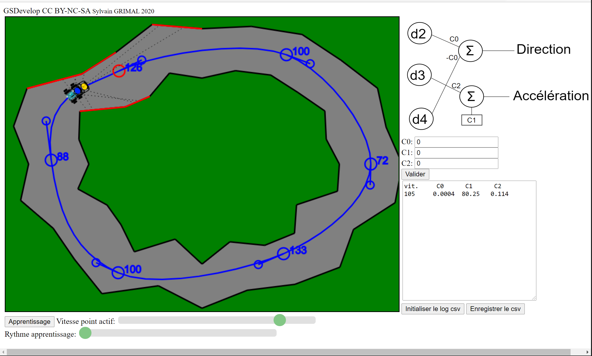

 

   
    
   Plateforme d'étude de L'Intelligence Artificielle
   Véhicule autonome 

##    1) Introduction

Cortex est un véhicule d'étude de l'Intelligence Artificielle avec réseaux de neurones.
cliquer pour voir la vidéo sur youtube:

Cette plateforme permet de découvrir les alghorithmes génétiques ainsi que l'apprentissage supervisé.

 

Il comprend des programmes en javascript de simulation permettant l'entrainement d'un reseau de neurones ainsi qu'un petit véhicule réel d'experimentation.
Le véhicule perçoit son environement grace à un lidar "YDlidar X4"

 

La version la plus simple comprend 5 neurones: 3 de présentation et 2 de sortie.

Il existe aussi une version à 12 neurones: 5 de présentation, 5 d'une couche intermédiaire et 2 de sortie.
 

Le modèle est entierement imprimable en 3D

**Dans le dépot Cortex vous trouverez :**

* les fichiers CAO, STL pour imprimantes 3D
* Les sources Html et javascript pour l'entrainement
* Le source ESP32 ou Arduino Due pour IDE Arduino

L'ensemble est sous licence **CC BY-NC-SA**

**Les éléments suivants sont nécessaires:**

* YDlidar X4
* Arduino Due ou ESP32 ( Il existe de nombreux modules, les fixations sont prévues pour un ESP32 DEVKIT V1: 30 broches)
* Carte double variateur type TB6612 ou DRV8833
* Module d'alimentation découpage type lm2596
* 2 x Moteurs reductés, roues
* Support de batterie
* Visserie

##    2 Câblage

**Liasons Arduino Due ou ESP32 Lidar:**  
* RX ESP32 (RX2) / Tx Lidar
* TX ESP32 (RX1) / Rx Lidar

**Liaisons Arduino Due ou ESP32 Variateur:**  
* Arduino Due ou ESP32 D25 / APWM 
* Arduino Due ou ESP32 D33 / AIN2  // Marche avant: 1 Marche arrière: 0  
* Arduino Due ou ESP32 D32 / AIN1  // Marche avant: 0 Marche arrière: 1
* Arduino Due ou ESP32 D25 / BPWM 
* Arduino Due ou ESP32 D33 / BIN2  // Marche avant: 1 Marche arrière: 0  
* Arduino Due ou ESP32 D32 / BIN1  // Marche avant: 0 Marche arrière: 1				

**Et les alimentations:** Le 5v est fourni par un mini-module regulateur 5V à découpage 

##   3) Vidéos

à faire
* [Présentation: https://youtu.be/](https://youtu.be/)
* [Algorithme génétique: https://youtu.be/](https://)
* [Apprentissage supervisé: https://youtu.be/](https://youtu.be/)
* [Modélisation caméra sténopé: https://youtu.be/](https://youtu.be/)

